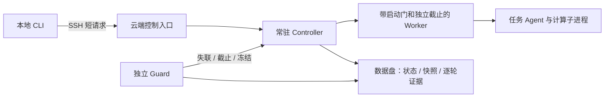

# 通用 AutoResearch 长程 Agent 控制器

本工具是 [统一双 Agent 长跑规范](../../双Agent长跑与题目包验收规范.md) 强制采用的任务控制入口。题目只写薄适配器，不复制控制状态机；GPU 作业必须接入受管 gpu_scheduler，巡检/登记使用 gpu_monitor。下文描述工具能力，正式运行还须满足工作区预算、隔离和真实验收要求。

本工具负责一个研究任务的启动、续轮、停止、上下文交接和故障接管。任务通过 argv 命令和 JSONL 事件接入；模型、研究框架、容器和评分器由任务适配器提供。不保留旧任务、旧 profile 或旧运行目录兼容层。

科学评分收口、可信凭证、正式阶段合同和只读历史审计见 [COMPLETION.md](COMPLETION.md)。正式 `screen`、`formal`、`final` 阶段必须声明 `score_expectation: required`；只有显式 `diagnostic`/`not_expected` 可以合法无科学分数。

工作区共享 GPU 要求：不因其他计算进程出现自动停止自己的训练，在不影响他人的前提下继续共享；显存余量、实测峰值、并发/CPU负载与共享观察由题目适配器落实。本控制器不因未知 GPU PID 停训，硬截止、明确安全风险和用户停止仍按合同执行。历史发布 bundle 保留当时内容，不热改。

题目适配器必须通过 [gpu_scheduler](../gpu_scheduler/README.md) 提交 GPU 训练、评分和复验；本地控制 Agent 优先使用阻塞式 `submit`，等 GPU 作业完成或关键中断再继续；只有需要持续跟踪进度或同时编排多个任务时才调用 `submit_async`/`enqueue`。资源暂不足的合法请求进入队列，排队仍受原预算约束；等待中断不等于作业已取消，先查询同一 request/job。阻塞期间需由适配器独立维护真实心跳与定向清理，SDK 不会自动替代本控制器心跳；该调用规范不表示本控制器自动接管了 GPU 调度器生命周期。

**执行端要求 Linux 5.3+、Python 3.10+、可读取同用户 `/proc`、支持 pidfd；仅用 Python 标准库。** 控制器源码版本与配置在 `init` 时记录哈希，正在运行的版本应使用独立发布目录。当前状态 schema 为 2，配置 version 为 1。

默认单轮为 90 分钟（5400 秒），所有模型一致。适配器必须从本轮 `launch.json.seconds` 读取实际限额并传给 Harbor/provider；它可能因父级余额而更短，不能另写固定的 3300 秒时限。

## 从本地控制云端

controller、guard、worker 和原始日志全部常驻执行主机。SSH 只承载短控制请求，本地终端或 SSH 断开不影响已经启动的云端任务。重新打开终端后，使用相同连接配置和 run-id 查询即可。



先复制并填写 [连接配置](connection.example.json) 和 [任务配置](controller.example.json)。连接配置只放主机、用户、端口、解释器和目录；认证默认沿用 SSH key/agent，也可将 `auth_file` 指向工作区受管凭据（与 `gpu_monitor` 相同的密码认证入口），二者不能同时配置。控制器默认使用 `150000` token 上限、`120000` 触发压缩、`16384` 保留区并启用自动压缩；若实际 provider 容量不同，必须在任务配置中显式覆盖这些字段。以下命令在工具目录执行：

```bash
python3 -B controller.py --remote connection.json deploy
python3 -B controller.py --remote connection.json init --config controller.json --run-id trial-01
python3 -B controller.py --remote connection.json start --run-id trial-01 --background
python3 -B controller.py --remote connection.json status --run-id trial-01
python3 -B controller.py --remote connection.json watch --run-id trial-01 --interval 10
python3 -B controller.py --remote connection.json logs --run-id trial-01 --stream stderr
python3 -B controller.py --remote connection.json doctor --run-id trial-01
```

`deploy` 只部署控制器白名单到新的 `controller_dir`，核验文件哈希、权限与数据盘；已有目录拒绝覆盖。任务代码/数据应按本题授权另行准备，`deploy` 不启动研究任务。云端 `start` 强制后台和 guard。部署失败的残留发布目录保留排障，用新发布路径重新准备。

`data_mount` 必须是真实挂载点且设备不同于 `/`；发布目录、状态、任务新增写入和缓存放在数据盘。启动后也检查挂载设备是否变化。TMPDIR、XDG、pip、HF、Torch、npm 缓存默认落在本轮目录。只读系统程序可复用。自行启动的 Docker/containerd、其他框架缓存与挂载仍由任务适配器预检；工具不改公共 daemon，不会自动迁移它们。

后台启动返回带 request-id、attempt 和 PID 身份的 `ACCEPTED` 回执。它表示 controller 接管成功；worker 是否启动及最终结果以 `status` 和逐轮 `exit.json` 为准。SSH 失败/超时报告 `UNKNOWN`，不自动重发变更请求；先查同一 run，避免重复启动。`watch` 遇到断线报告 UNKNOWN，按间隔继续只读查询。

## 先跑一个无 GPU 的本地烟测

[demo.config.json](templates/demo.config.json) 配合 [demo_agent.py](templates/demo_agent.py) 演示两代上下文自动交接，不访问模型或网络。路径按配置文件所在目录解析。

```bash
# 从 tools/research_handoff 执行；为每次测试指定新的状态目录/run-id
python3 -B controller.py --state-dir ./smoke-state \
  init --config templates/demo.config.json --run-id smoke-01
python3 -B controller.py --state-dir ./smoke-state start --run-id smoke-01 --background
python3 -B controller.py --state-dir ./smoke-state watch --run-id smoke-01 --json
python3 -B controller.py --state-dir ./smoke-state doctor --run-id smoke-01
```

本机测试可不配置 `storage.data_mount`，状态会注明未验证数据盘。云端连接入口强制数据盘检查。`--no-guard` 仅用于本地诊断。

## 时间窗口和续轮

| 字段 / 行为 | 含义 |
|---|---|
| `budget.window_seconds` | active 目标或 wall 窗口 |
| `budget.hard_limit_seconds` | 从首次 start 起固定墙钟上限；工作区正式运行默认不超过 43,200 秒，不启用 `allow_extended_hard_limit`。明确用户例外授权可显式扩展，工具最大 259,200 秒 |
| `turn.seconds` | 每轮最长执行时间，实际取本轮、目标窗口与剩余硬预算的适用最小值 |
| `credit_policy: running` | 按观测到的 worker 执行区间记活动时间；故障未知区间不记 |
| `credit_policy: successful_turn` | 退出 0、上下文报告有效、收到 `turn.completed` 且 `credit: true`、清理成功后才记活动时间 |
| `credit_policy: reported` | 满足成功轮条件后，只计适配器报告的有限非负 `credited_seconds`；要求非空 `credit_evidence`，报告不能超过本轮真实执行时间 |
| `runtime_seconds` / `credited_seconds` | 分别展示观测执行量和已确认信用；`reported` 不暂计未完成轮，其他策略的运行中 `active_seconds` 可含当前暂计区间 |
| `turn.seconds` | 每轮上限，不能超过 5400 秒或 run 的硬截止 |
| `policy.retry_backoff_seconds` | 单轮可恢复异常后的重试退避秒数；重试次数不设上限，由原目标和硬截止约束 |

重试退避期间控制器持续刷新自身心跳，独立 guard 仍可停止冻结或失联的控制器。退避不刷新 Agent 心跳，不获得运行或研究信用；人工停止和原硬截止仍生效。

单调时钟控制执行间隔，绝对截止与单调时间取更严格者。停止、压缩等待、恢复均不延后截止；预算保存已观测墙钟年龄，回拨或 boot identity 变化时 `budget.view.clock_issue` 明确报告原因并 fail closed，跨 boot 未结束区间不获得活动信用。已有 `rebase --reason` 只允许停止且已清理的 controller-loss run 在原绝对截止仍有效时重建 monotonic baseline，拒绝时钟回拨，也不改变目标、原截止和信用。所有 ISO 时间戳须包含时区，`+08:00` 等偏移按实际 instant 解析。`successful_turn` 在完整轮结束判断目标，可超过目标到当前轮结束，但绝不突破硬截止。worker 到期立即取消计算；内核调度和进程回收存在少量延迟，外部资源取消另有有界超时。

`reported` 适合由任务原始事件独立审计有效时间的适配器。`turn_complete(credit=True, credited_seconds=..., credit_evidence=...)` 只报告该轮新增信用，不重复提交历史结转；将目标设为原目标减去已核验结转。排队、安装、基础设施故障和其他排除区间由适配器记在证据中；控制器校验数值边界，不自行判断证据是否构成科研闭环。

显式启用 `budget.allow_partial_credit: true`（仅限 `reported`）后，失败或超时轮可另记研究信用，轮次失败原因和分数保持真实。可信宿主适配器的 cleanup hook 在回收资源后写 `turn_dir/partial-credit.json`：`version:1`、`run_id`、`turn`、`intervals:[[UTC_epoch_start,UTC_epoch_end]]`、`credited_seconds`、`evidence:[{path,sha256}]`。控制器核对本轮身份、区间边界、不重叠、总秒数及可信宿主原件哈希；报告不能超过 worker runtime。可用 `turn.credit` 提前提供该报告路径/哈希，但清理完成后仍重新验证。原生会话审计可复用 `core/research_time.py`，由题目回调核对真实 GPU 反馈；未结束工具调用、排队、安装和故障等排除区间必须留证，信用不代表完整评分闭环。

科学收尾适配器应在 `adopt_evaluation()` 之前用 `core.credit.persist_report()` 保存去重、裁剪到本轮执行区间及剩余有效预算的时间证据，不预留虚拟的最后一秒。该函数同时冻结宿主证据并写 `effective-time.json` 和 `partial-credit.json`；cleanup 不应覆盖已有凭证。预算达到目标与科学 receipt 是否通过分别记录。

确定性合同不兼容由 `CompletionContractError` 表达，适配器发送 `completion_contract_error` helper 或 `turn.failed` 事件，声明 `reason: completion_contract_error`、`failure_class: contract`、`retryable: false`，并提供当前轮宿主失败证据及 SHA-256。控制器在原轮、心跳和 run 截止内等待适配器退出，清理后验证独立 partial credit，随后 `PAUSED`，不会自动调用模型重试；合同失败和真实科学分数保留。签名、评分或哈希认证失败仍为 `deterministic_evidence_failure`，不能由该合同分类获得信用。

已停止且确认 controller/guard/worker 均回收的 run，可通过 `amend` 切换不可变发布、配置和历史信用审计。命令需要当前 `--expected-config-sha256`、`--expected-turn` 及非空授权理由；身份、起点、目标和上下文不变，旧配置、状态、原始 exit 不覆盖，修订收据保存在 `amendments/NNNNNN/`。历史审计只补原零信用且未调整过的轮次，拒绝重计。截止修改须有明确用户授权；默认上限仍为 12h，显式例外可启用 `allow_extended_hard_limit`，最高 72h。72h 仅为显式授权后的工具上界，实际运行受用户指定的绝对截止约束，首次起点不能重置。截止延期（包括原预算尚未到期时）须传入 `--extend-expired-budget`，仅允许已完全回收、目标未完成的 run 延长至未来且晚于旧截止；该操作不增加历史信用，保留首次起点、目标、旧状态/exit 和修订收据。EXPIRED 修订后为 PAUSED，仍须显式 `start --resume`。已达成目标的 COMPLETED 不可延期。

存储迁移须有明确授权，保持所有run/root绝对路径，用独立数据卷或bind mount承接新设备，并在原设备保留完整旧副本。`amend --storage-migration-source <旧副本根>` 对新 `storage.data_mount` 下的run和研究root逐文件校验内容、权限、归属及符号链接，并核验原设备和上轮cleanup；失败不修改状态。此操作保存旧/新设备与目录清单hash，不允许同时改截止或添加历史信用。路径、科学合同、上下文和有效预算仍保持原值；迁移后显式doctor/start --resume。

```bash
python3 -B controller.py --remote connection.json amend --run-id trial-01 \
  --config amended-controller.json --credit-file historical-credit.json \
  --expected-config-sha256 <current-sha256> --expected-turn <current-turn> \
  --reason "用户授权暂停迁移与历史信用修订"
python3 -B controller.py --remote connection.json start --run-id trial-01 --resume --background
```

## Docker 构建与运行网络

可选 `providers.harbor_docker.ManagedDockerEnvironment` 统一提供 Harbor Docker 网络边界。构建使用 BuildKit 支持的 `build.network: default`（Docker 默认网桥）；不要写 `bridge`，该值会被当前 BuildKit 拒绝。运行时主容器共享 Harbor egress sidecar 的网络命名空间；只允许配置中固定 IP 的模型 HTTPS 443，普通外网、DNS、宿主网关和其他容器地址被拒绝。无模型通道时采用 `NO_NETWORK`，独立 `tests/` verifier 使用 `network_mode: none`。solver 无 NET_ADMIN、无任意 sudo、无 Docker socket是题包必须提供的配套权限边界。provider 不改宿主全局防火墙。

控制器配置增加：

```json
"docker_network": {
  "enabled": true,
  "docker_host": "unix:///var/run/docker.sock",
  "build_network": "default",
  "runtime_mode": "isolated",
  "model_host_addresses": {"model.example.com": "203.0.113.8"}
}
```

Harbor `environment.import_path` 指向 `tools.research_handoff.providers.harbor_docker:ManagedDockerEnvironment`，`kwargs.network_config` 传本轮 `launch.json.docker_network`，`kwargs.ownership_root` 指向可信数据盘归属目录。该 provider 依赖已验收的 Harbor Docker API；普通 CPU 控制器不导入 Harbor。任务多服务自定义网络须另行验收，不能据主容器隔离推断所有 side service 都隔离。

`doctor` 和每轮启动前核对默认 bridge 元数据、内核接口、网关、NAT 和模型转发。`doctor` 与 `docker-network --config network.json` 只读；缺失转发会直接报告，不能仅因桥仍存在就宣布网络健康。`--repair` 可补建无附着容器的缺失接口，并补齐明确配置的专用桥转发。配置 `bridge_interface` 为该专用桥名称、`repair_forwarding: true` 时，正式启动及 provider 模型阶段也可恢复缺失的端点规则；禁止自动修公共 `docker0`。宿主恢复仅增加本题桥、子网和模型 IP 的 HTTPS 规则，不清空链、不改变策略、不重启共享服务。provider 随后从受限 solver 内做有界 TCP/TLS 预检，失败时不启动模型请求；归属目录保留桥、HTTPS 与 namespace 策略回执。预检不代替真实模型工具调用与普通外网拒绝探针。

复用公共 Docker 时，若其他运行时启动清除了 `docker0` 转发，显式执行 `docker-network --config network.json --repair --restore-default-forwarding` 可恢复默认桥构建的正常外网访问。配置必须启用网络且明确 `bridge_interface: docker0`；只增加匹配该接口和其实际子网的 NAT、出站及已建立连接返回规则，不修改其他桥、链策略或共享服务。Agent 仍由 sidecar namespace 的 nft 规则限制到冻结模型端点；这项恢复不会自动运行。`--repair` 单独使用只修公共缺失接口，转发保持只读检查。
恢复规则追加到宿主现有转发规则之后，保留 `DOCKER-USER` 的策略和 MSS 修正；显式恢复同时会将本工具旧版本置于该链之前的同名规则移到其后。出口 MTU 小于网桥时，TCP 建连成功不能替代真实 TLS 验收。

公共默认桥需要开机自恢复时，在明确维护授权下复用发布中的 `templates/public_docker_network.service.in` 与 `public_docker_network.timer.in`。将 `@DATA_MOUNT@`、`@RUNTIME_DIR@`、`@CONTROLLER_DIR@`、`@NETWORK_CONFIG@` 替换为已校验绝对路径；配置必须限定公共 socket 和 `docker0`。安装为 `autoresearch-public-docker-network.service` / `.timer`，先 `systemd-analyze verify`，再 `systemctl enable --now autoresearch-public-docker-network.timer`。timer 每15秒执行现有官方修复命令，包括失败后的再次检查；没有独立循环、研究重启或daemon重启。日志、TMPDIR、缓存和不可变发布均在数据盘。

Docker/containerd 应使用现有开机启用、`Restart=always` 的系统服务，并通过 `RequiresMountsFor` 等待数据盘。增加依赖与timer只需 `daemon-reload`，不为部署重启活动daemon。桥缺失且仍有附着容器时，官方修复会拒绝，必须核查归属；不删除容器、不清空规则或操作另一运行时。健康验收须包括默认桥HTTPS构建、实际solver网络隔离、至少两次timer成功执行及daemon PID未变化。systemd进程健康不代表内核桥持续存在，现有主机日志不足时不得推定删除方。

兼容 Responses 的外部模型可通过 `providers.codex_transport.transport_flags` 生成专用 `research_https` provider：HTTPS URL、`wire_api=responses`、`supports_websockets=false`，以及有界请求/流重试与读空闲窗口。API key 只引用环境变量，不进入参数；不使用已经 removed 的 `responses_websockets` feature 开关。任务薄适配器接受 `model_transport` 配置，并保留未显式配置模型的原有传输。

显式 HTTPS transport 默认 `request_max_retries: 8`、`stream_max_retries: 8`、`stream_idle_timeout_ms: 90000`；重试参数允许整数 `0..8`，读空闲窗口允许整数 `1000..300000` 毫秒。Codex 0.159.3 对部分 HTTP 400 错误直接退出，因此正式适配器还须在原生二进制哈希与版本验证后调用 `providers.codex_retry_install.install_retry(agent, environment, model_transport, iteration_timeout_seconds)`，只安装到本轮新建的 Harbor 容器。未显式配置 transport 时保留原有路径。

受管传输层在同一个 Codex 进程/turn 内重试模型访问失败，包括所有非成功 HTTP 状态、认证/路由/参数错误、连接/TLS/读超时、错误响应、SSE error/failed/incomplete 和未完成断流。首次加最多 8 次重试，退避为 1、2、4、8、10、10、10、10 秒；上游读空闲窗口 90 秒，原单轮超时、停止信号与 controller 原硬截止优先。loopback provider 的 Codex 内部重试设为 0/0，并禁用 `unbounded_connection_retries`，避免重复叠加。完整 SSE 成功响应先校验再交给 Codex；失败尝试的半段文本或工具事件不会交付，等待期间只发送 SSE comment 心跳。该策略会推迟本次响应的显示与工具执行，仍保留原会话。重试日志 `/logs/agent/model-transport.jsonl` 只记录请求标识、尝试次数、状态和错误分类，不写密钥或请求/响应内容。loopback proxy 复用已冻结 HTTPS 端点，不增加外网访问权限。

上述策略不改变 controller 轮次重试、计时或预算。冻结配置的显式旧值仍优先于默认值，迁移必须生成新配置和不可变发布，不热改活动目录。离线回归用 `CODEX_TRANSPORT_TEST_BINARY` 指定实际 Codex 二进制，验证 HTTP 400 恢复仍只有一个 turn，以及耗尽时上游恰好 9 次，不访问付费模型网关。

成功轮可在冻结配置的同一预算内续轮。进程非零退出、worker 意外退出、显式 `turn.failed`、缺少完成事件/上下文报告、心跳丢失、worker 错误及单轮超时默认持续重试，不设次数上限；每次失败 attempt 独立留档且不获得成功轮信用。清理钩子收到 `AUTORESEARCH_RETRY_PENDING=1` 时应保留跨轮运行资源，仅清理本轮资源。人工停止、预算或硬截止、guard 丢失、存储/挂载异常、清理失败及其他不可恢复错误不会重试，并按合同收尾。研究排队、工具阻塞等轮内细分、可信评分和 QA16 科研有效时间仍需任务适配器另留证据；进程活动秒数不自动等于科研有效时间。

## Agent 接入协议

### GPU 作业等待协议

本节是 durable 版合同；先核实际 scheduler/客户端/控制器/适配器发布，再读 [GPU 正确使用指南](../gpu_scheduler/USAGE.md) 和 [公共进展](../../ops/gpu_scheduler/进展清单.md)。已上传的 v5 未安装/切换时，旧运行不能仅换客户端采用新协议。

GPU 提交、等待、重连和事件透传由官方 `gpu_scheduler` SDK 负责。任务适配器不得实现
`ensure_job`、固定 queue timeout 或私有轮询器。适配器把 SDK 返回的同一个
`request_id`/`job_id` 快照传给 `agent_protocol.gpu_state(job)`；helper 会产生
`gpu.state` 事件，事件至少包含 `state`、`request_id`、`job_id`、`session_id`，并可包含
`reason`、`scheduler_root`、`queue`、`projected_start`、`latest_start`、`sequence` 和
`reconciling`。事件不得生成新的 request。

控制器在当前轮次内将 `QUEUED`、`STARTING`、对账中的 `UNKNOWN` 和
`SESSION_CHANGED` 置为 `WAITING_GPU`。等待区间保留在该轮的 `gpu-wait.json`，不计
有效研究时间、不消耗 Agent retry，也不产生新的轮次；恢复必须继续查询原 request。
worker、controller 和 guard 均按扣除等待后的单轮执行时间判断截止，原 run 墙钟硬截止
仍生效。等待结束的 `INFEASIBLE`/`EXPIRED` 回到当前 Agent 调用，Agent 可继续 CPU 工作或
调整实验；适配器若因这些状态退出，控制器将其归为 `failure_class: infrastructure` 并
暂停。对账失败的 `UNKNOWN` 也暂停，不按 `agent_exit_nonzero` 自动重试。适配器可显式
报告 `turn.failed`，其 `reason` 为 `gpu_infeasible`、`gpu_expired`、`gpu_unknown`、
`gpu_reconciling` 或 `gpu_session_changed`，同时声明 `failure_class: infrastructure`。
正常连接下官方 watch 最长 10 秒返回一次状态/快照；这不是网络断线时的实时性保证。客户端断线时先查询原 request，不能
以 transport timeout 推断作业失败。

标准接入为 `Client.submit(spec, on_update=lambda job: agent_protocol.gpu_state(job))`，调用前完成真实 context/心跳协议，spec 必须含原父级 deadline 和完整 max_runtime。helper 将 id/revision 映射为 job_id/sequence，预测值留在 queue；不能手造“已运行”事件结束真实排队。UNKNOWN 仅 reconciling=true 时暂停等待计时，其他 UNKNOWN 交基础设施接管。改变实验必须符合原协议/预算并登记新意图，原终态请求不可改 spec 重新排队；控制器不会自动改变规模或自动重建已经结束的 worker。

复制或导入 [agent_protocol.py](templates/agent_protocol.py)。每轮读取 `AUTORESEARCH_CONTEXT_FILE`；其中含 generation、conversation_id、上一代完整 handoff、预算和本轮目录。

```python
from agent_protocol import context, heartbeat, context_usage, turn_complete

ctx = context()
conversation = ctx.get("conversation_id") or create_new_conversation(ctx.get("handoff"))
# 同 generation 后续轮必须恢复同一 conversation；未显式指定新 ID 时，压缩/重开后继续沿用已知会话。
context_usage(used_tokens=actual_total_tokens, conversation_id=conversation)
heartbeat()
# 执行任务，实际进展循环中持续 heartbeat，并在每次模型返回后报告总上下文占用。
turn_complete(credit=True)
```

支持 `heartbeat`、`context.usage`、`context.compact`、`turn.completed`、`turn.failed`。每条事件必须含整数 generation；helper 自动附加。context.usage 还必须含非空 conversation_id 和非负整数 used_tokens。这里是**当前会话完整占用**，包括系统提示、工具、附件和历史，不能填累计计费 token 或仅最后一次输出。普通文本和 `{"event":"heartbeat"}` 不计心跳。半行 JSON 会保留到下次读取，单行事件上限 128 KiB。

同 generation 中 token 不可倒退、conversation_id 不可切换。默认每轮至少一次有效占用报告；缺失、旧 generation、非法 token 或会话跳变使该轮失败。首个 heartbeat 缺失也会超时。不要用独立“假心跳”线程掩盖卡死的实际进展循环。

## 压缩与重开对话

适配器应在**发请求前**使用 provider/tokenizer 的真实计数检查下一请求，helper `fits_request` 可检查输入和输出预算。控制器不能猜测不透明 SDK 内部的 token，也不能替代模型端输出上限。

1. `compact_at_tokens + reserve_tokens <= max_tokens`，给工具返回与摘要保留空间。
2. 达到阈值后写本轮 `context-request.json`，要求总结并退出；最多等待 `summary_seconds`，仍受本轮/总截止限制，达到 `max_tokens` 立即停。
3. 适配器可用 `compaction_requested()` 观察请求，生成摘要、调用 `compact(summary)` 和 `turn_complete(credit=True)`，然后正常退出。
4. `auto_compact: true` 时，成功轮及有效摘要触发快照 → generation + 1 → 新轮。控制器在达到 `max_tokens` 时立即执行硬兜底；若 agent 未提交摘要，会写入明确标注为不完整的控制器交接摘要并自动开启新代际，失败轮不计信用。只有关闭自动压缩或发生不可恢复的状态/存储故障时才进入 `WAITING_COMPACTION`；没有摘要不会伪造研究结论。

摘要截止与完成事件 grace 截止、对应 boot identity 同时写入 `state.context`，保存 monotonic 和带时区的绝对截止；同一轮重新加载状态不会重置等待期限，换 boot 立即拒绝旧 guard 的时钟。只有新轮或新 generation 清除已结束的 guard 字段。`core/turn_outcome.py` 统一计算轮次原因、信用与重试规则；进程清理、任务清理和信用证据仍由 controller 执行并作为最终决策输入。

`start_turn` 会把 `AUTORESEARCH_CONTEXT_MAX_TOKENS`、`AUTORESEARCH_CONTEXT_COMPACT_AT_TOKENS` 和 `AUTORESEARCH_CONTEXT_RESERVE_TOKENS` 注入适配器环境。适配器应在每次 provider 请求前用真实 tokenizer 计数调用 `fits_request`；即使适配器失守，控制器仍会在硬上限触发后终止本轮并保全日志。

人工压缩或主动重开必须先等 controller/worker 退出，并携带当前 generation 和摘要文件：

```bash
python3 -B controller.py --remote connection.json context compact \
  --run-id trial-01 --generation 3 --summary-file summary.md
python3 -B controller.py --remote connection.json start --run-id trial-01 --background

python3 -B controller.py --remote connection.json context reopen \
  --run-id trial-01 --generation 4 --conversation-id new-chat-05 --summary-file handoff.md
```

本地摘要通过 SSH 请求传到云端，不要求两台机器共享路径。compact 在未请求压缩时需 `--force`；reopen 用于主动结束旧会话。两者都创建不覆盖的 `snapshot-XXXX.json`，保存原 generation、会话、摘要 SHA-256、预算和轮次索引；原 stdout/stderr 保留，适配器自己的完整 transcript 也应写入 turn 目录。generation 是控制器代际，不等同于供应商的 conversation ID；未传 `--conversation-id` 时，下一代沿用上一代已知会话，只有显式传入新 ID 才切换供应商会话。同一 generation 内仍禁止切换会话 ID。

旧 generation 的迟到操作会被拒绝。运行中的状态锁拒绝外部压缩/重开；摘要损坏或 hash 不符拒绝启动。重开不清除 STOP、失败状态或 resume 要求；若原状态为 STOPPED/FAILED/PAUSED，仍须显式 `start --resume`。COMPLETED/EXPIRED 不可重开预算。

## 停止、恢复与快速 debug

```bash
python3 -B controller.py --remote connection.json stop --run-id trial-01 --reason "检查 GPU 状态"
python3 -B controller.py --remote connection.json status --run-id trial-01
python3 -B controller.py --remote connection.json doctor --run-id trial-01
python3 -B controller.py --remote connection.json logs --run-id trial-01 --stream stderr --bytes 32768
python3 -B controller.py --remote connection.json logs --run-id trial-01 --stream events
# 仅 controller 已死亡、核对状态后：
python3 -B controller.py --remote connection.json recover --run-id trial-01
python3 -B controller.py --remote connection.json start --run-id trial-01 --resume --background
```

若旧 cleanup 钩子因缺失重启退出证据而失败，可在执行主机使用
`recover --run-id <id> --cleanup-config <config.json> --reason <reason>`。
替代配置只能改变 `cleanup` 和 `env`，其余冻结字段必须与原配置一致；
控制器、guard 和所属 worker 必须已退出。该操作保存替代配置、哈希及真实
cleanup 回执，再按零信用恢复原轮；不会补造 `worker-exit.json`，也不会激活
新运行配置。之后仍须 `rebase`（跨 boot）、`amend`、`doctor` 和显式 resume。

| 现象 / stop_reason | 查看与处理 |
|---|---|
| `UNKNOWN` | SSH 未确认；用同一 run-id 重查，禁止据此自动重发变更 |
| `CONTROLLER_LOST` / `controller_stale` | guard.log、attempt exception.log；recover 验证并回收后显式 resume |
| `heartbeat_stale` | stdout 是否持续产生协议心跳；普通日志不续命 |
| `context_usage_missing` / `invalid_agent_event` | 查事件 generation、总 token、会话 ID，修适配器 |
| `completion_missing` | 没收到可信 `turn.completed` / boolean credit，退出 0 不足以证明完整轮 |
| `completion_contract_error` | 确定性科学收尾合同不兼容；查当前轮失败原件、错误码和独立时间凭证，修复后显式接管，不自动续轮 |
| `WAITING_COMPACTION` | 仅在关闭自动压缩或不可恢复故障时出现；查 pending-summary、原日志，提交当前 generation 的摘要 |
| `cleanup_incomplete` | 查 cleanup.log/receipt；外部资源确认回收前不继续 |
| `storage_limit` / `storage_changed` | 查 run 字节数、剩余空间、实际挂载；不自动删历史证据 |
| `hard_limit` | 本 run 到期，保全证据与未完成项；不能延长原预算 |

退出码：正常停止/完成/等待交接为 0，运行故障为 1，参数/请求错误为 2，预算硬到期为 3；**0 不代表研究目标完成**，读取 status/stop_reason。`doctor` 检查源码/配置、设备、进程身份、事件与快照，并附最新 stderr 尾部。`logs` 最多返回 1 MiB，不拉取全量模型。

controller PID 只按 pidfd 与启动时刻/boot 身份通知，不向调用者所在进程组发送信号。每轮随机 token 标记计算进程；能回收保留该环境变量的同用户后代，包含 setsid 和忽略 TERM 的进程。标记是协作式所有权机制，不能用作对恶意代码的 sandbox；换 UID、清空环境、Docker daemon 或外部调度作业需要独立取消接口。

若任务启动容器/调度作业，配置 `cleanup: {"command": ["python3", "cancel_owned_jobs.py"], "timeout_seconds": 10}`。hook 获得当前 AUTORESEARCH_RUN_ID/TURN/TURN_DIR，必须幂等、仅取消本轮资源、验证回收后退出 0。它在每轮结束（含成功）执行，最多 30 秒；成功 receipt 避免重复取消，失败尝试独立留证，后续 resume 被阻止。跨轮资源须由适配器明确管理。

## 证据与发布

```text
runs/<run-id>/
  config.json                     # 冻结的非秘密配置
  state.json                      # 原子替换；含源码/config hash 与预算
  launch.json / exit.json          # 最新 attempt 回执；新启动清除旧 exit
  attempts/000001/launch.json      # 每次 controller 接管均独立留证
  attempts/000001/exit.json        # 异常时还会有 exception.log
  events.jsonl                    # 追加事件
  controller.log / guard.log
  context/current.json / latest.json / snapshot-*.json / pending-summary.json
  turns/000001/
    launch.json / GO / context.json / context-request.json
    stdout.log / stderr.log
    worker-start.json / worker-exit.json / exit.json
    cleanup.log / cleanup-exit.json / cleanup-attempt-*.json
    tmp/ / cache/
```

快照/state/回执原子写入并 fsync；stdout/stderr 为流式文件，不能称为原子 transcript。日志按轮保留，达到 run 字节/磁盘余量阈值停止，不覆盖或滚动删除唯一证据。阈值约每秒采样，不是文件系统硬 quota；生产环境可在数据卷再配置 quota。run 根权限 0700；env 只放非秘密配置，密钥沿用执行主机受控接口，继承的完整环境不会写入 launch.json。

```bash
python3 -B bundle.py --output /mnt/data/staging/controller-v2
python3 -B bundle.py --check /mnt/data/staging/controller-v2
python3 -B -W error::ResourceWarning -m unittest discover -s tests -v
```

bundle 包含 16 个白名单文件、哈希与可执行权限；检查缺失、额外文件/目录、symlink、内容和 manifest 白名单。源码、示例、README、demo 随包发布，测试和事故记录留在源码工作区。manifest 提供完整性检查，不是数字签名；需要对照可信发布 manifest。

本地故障注入和 RPC 模拟验证不等于真实云 SSH/GPU、Harbor H06、VRAM 限额或科学结果验收。正式运行前按工作区部署手册核验数据盘与容器运行时、任务适配器、模型请求预算、真实 provider 取消、授权范围与证据合同。
