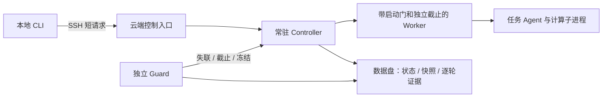

# 通用 AutoResearch 长程 Agent 控制器

本工具负责一个研究任务的启动、续轮、停止、上下文交接和故障接管。任务通过 argv 命令和 JSONL 事件接入；模型、研究框架、容器和评分器由任务适配器提供。不保留旧任务、旧 profile 或旧运行目录兼容层。

工作区共享 GPU 要求：不因其他计算进程出现自动停止自己的训练，在不影响他人的前提下继续共享；显存余量、实测峰值、并发/CPU负载与共享观察由题目适配器落实。本控制器不因未知 GPU PID 停训，硬截止、明确安全风险和用户停止仍按合同执行。历史发布 bundle 保留当时内容，不热改。

题目适配器接入 [gpu_scheduler](../gpu_scheduler/README.md) 时，本地控制 Agent 优先使用阻塞式 `submit`，等 GPU 作业完成或关键中断再继续；只有需要持续跟踪进度或同时编排多个任务时才调用 `submit_async`/`enqueue`。资源暂不足的合法请求进入队列，排队仍受原预算约束；等待中断不等于作业已取消，先查询同一 request/job。阻塞期间需由适配器独立维护真实心跳与定向清理，SDK 不会自动替代本控制器心跳；该调用规范不表示本控制器自动接管了 GPU 调度器生命周期。

**执行端要求 Linux 5.3+、Python 3.10+、可读取同用户 `/proc`、支持 pidfd；仅用 Python 标准库。** 控制器源码版本与配置在 `init` 时记录哈希，正在运行的版本应使用独立发布目录。当前状态 schema 为 2，配置 version 为 1。

## 从本地控制云端

controller、guard、worker 和原始日志全部常驻执行主机。SSH 只承载短控制请求，本地终端或 SSH 断开不影响已经启动的云端任务。重新打开终端后，使用相同连接配置和 run-id 查询即可。



先复制并填写 [连接配置](connection.example.json) 和 [任务配置](controller.example.json)。连接配置只放主机、用户、端口、解释器和目录；认证沿用 SSH key/agent，首次连接前建立可信 known_hosts。任务配置中的 `context.max_tokens`、`compact_at_tokens`、`reserve_tokens` 必须按实际模型显式填写，缺失即拒绝初始化；示例数值仅用于展示格式。以下命令在工具目录执行：

```bash
python3 -B controller.py --remote connection.json deploy
python3 -B controller.py --remote connection.json init --config controller.json --run-id trial-01
python3 -B controller.py --remote connection.json start --run-id trial-01 --background
python3 -B controller.py --remote connection.json status --run-id trial-01
python3 -B controller.py --remote connection.json watch --run-id trial-01 --interval 10
python3 -B controller.py --remote connection.json logs --run-id trial-01 --stream stderr
python3 -B controller.py --remote connection.json doctor --run-id trial-01
```

`deploy` 只部署控制器白名单到新的 `controller_dir`，核验文件哈希、权限与数据盘；已有目录拒绝覆盖。任务代码/数据应按本题授权另行准备，`deploy` 不启动研究任务。云端 `start` 强制后台和 guard。部署失败的残留发布目录保留排障，用新发布路径重新准备。

`data_mount` 必须是真实挂载点且设备不同于 `/`；发布目录、状态、任务新增写入和缓存放在数据盘。启动后也检查挂载设备是否变化。TMPDIR、XDG、pip、HF、Torch、npm 缓存默认落在本轮目录。只读系统程序可复用。自行启动的 Docker/containerd、其他框架缓存与挂载仍由任务适配器预检；工具不改公共 daemon，不会自动迁移它们。

后台启动返回带 request-id、attempt 和 PID 身份的 `ACCEPTED` 回执。它表示 controller 接管成功；worker 是否启动及最终结果以 `status` 和逐轮 `exit.json` 为准。SSH 失败/超时报告 `UNKNOWN`，不自动重发变更请求；先查同一 run，避免重复启动。`watch` 遇到断线报告 UNKNOWN，按间隔继续只读查询。

## 先跑一个无 GPU 的本地烟测

[demo.config.json](templates/demo.config.json) 配合 [demo_agent.py](templates/demo_agent.py) 演示两代上下文自动交接，不访问模型或网络。路径按配置文件所在目录解析。

```bash
# 从 tools/research_handoff 执行；为每次测试指定新的状态目录/run-id
python3 -B controller.py --state-dir ./smoke-state \
  init --config templates/demo.config.json --run-id smoke-01
python3 -B controller.py --state-dir ./smoke-state start --run-id smoke-01 --background
python3 -B controller.py --state-dir ./smoke-state watch --run-id smoke-01 --json
python3 -B controller.py --state-dir ./smoke-state doctor --run-id smoke-01
```

本机测试可不配置 `storage.data_mount`，状态会注明未验证数据盘。云端连接入口强制数据盘检查。`--no-guard` 仅用于本地诊断。

## 时间窗口和续轮

| 字段 / 行为 | 含义 |
|---|---|
| `budget.window_seconds` | active 目标或 wall 窗口 |
| `budget.hard_limit_seconds` | 从首次 start 起固定墙钟上限，至多 43,200 秒，所有 mode 均适用 |
| `turn.seconds` | 每轮最长执行时间，实际取本轮、目标窗口与剩余硬预算的适用最小值 |
| `credit_policy: running` | 按观测到的 worker 执行区间记活动时间；故障未知区间不记 |
| `credit_policy: successful_turn` | 退出 0、上下文报告有效、收到 `turn.completed` 且 `credit: true`、清理成功后才记活动时间 |
| `runtime_seconds` / `credited_seconds` | 分别展示观测执行量和已确认信用；运行中 `active_seconds` 含当前暂计区间 |
| `turn.seconds` | 每轮上限，不能超过 5400 秒或 run 的硬截止 |
| `policy.retry_backoff_seconds` | 单轮可恢复异常后的重试退避秒数；重试次数不设上限，由原目标和硬截止约束 |

单调时钟控制执行间隔，绝对截止与单调时间取更严格者。停止、压缩等待、恢复均不延后截止；系统重启后旧 run 到期，不凭跨 boot 的计时推断信用。`successful_turn` 在完整轮结束判断目标，可超过目标到当前轮结束，但绝不突破硬截止。worker 到期立即取消计算；内核调度和进程回收存在少量延迟，外部资源取消另有有界超时。

成功轮可在冻结配置的同一预算内续轮。进程非零退出、worker 意外退出、显式 `turn.failed`、缺少完成事件/上下文报告、心跳丢失、worker 错误及单轮超时默认持续重试，不设次数上限；每次失败 attempt 独立留档且不获得成功轮信用。清理钩子收到 `AUTORESEARCH_RETRY_PENDING=1` 时应保留跨轮运行资源，仅清理本轮资源。人工停止、预算或硬截止、guard 丢失、存储/挂载异常、清理失败及其他不可恢复错误不会重试，并按合同收尾。研究排队、工具阻塞等轮内细分、可信评分和 QA16 科研有效时间仍需任务适配器另留证据；进程活动秒数不自动等于科研有效时间。

## Agent 接入协议

复制或导入 [agent_protocol.py](templates/agent_protocol.py)。每轮读取 `AUTORESEARCH_CONTEXT_FILE`；其中含 generation、conversation_id、上一代完整 handoff、预算和本轮目录。

```python
from agent_protocol import context, heartbeat, context_usage, turn_complete

ctx = context()
conversation = ctx.get("conversation_id") or create_new_conversation(ctx.get("handoff"))
# 同 generation 后续轮必须恢复同一 conversation；重开时必须使用新 ID。
context_usage(used_tokens=actual_total_tokens, conversation_id=conversation)
heartbeat()
# 执行任务，实际进展循环中持续 heartbeat，并在每次模型返回后报告总上下文占用。
turn_complete(credit=True)
```

支持 `heartbeat`、`context.usage`、`context.compact`、`turn.completed`、`turn.failed`。每条事件必须含整数 generation；helper 自动附加。context.usage 还必须含非空 conversation_id 和非负整数 used_tokens。这里是**当前会话完整占用**，包括系统提示、工具、附件和历史，不能填累计计费 token 或仅最后一次输出。普通文本和 `{"event":"heartbeat"}` 不计心跳。半行 JSON 会保留到下次读取，单行事件上限 128 KiB。

同 generation 中 token 不可倒退、conversation_id 不可切换。默认每轮至少一次有效占用报告；缺失、旧 generation、非法 token 或会话跳变使该轮失败。首个 heartbeat 缺失也会超时。不要用独立“假心跳”线程掩盖卡死的实际进展循环。

## 压缩与重开对话

适配器应在**发请求前**使用 provider/tokenizer 的真实计数检查下一请求，helper `fits_request` 可检查输入和输出预算。控制器不能猜测不透明 SDK 内部的 token，也不能替代模型端输出上限。

1. `compact_at_tokens + reserve_tokens <= max_tokens`，给工具返回与摘要保留空间。
2. 达到阈值后写本轮 `context-request.json`，要求总结并退出；最多等待 `summary_seconds`，仍受本轮/总截止限制，达到 `max_tokens` 立即停。
3. 适配器可用 `compaction_requested()` 观察请求，生成摘要、调用 `compact(summary)` 和 `turn_complete(credit=True)`，然后正常退出。
4. `auto_compact: true` 时，成功轮及有效摘要触发快照 → generation + 1 → 新轮；默认 false 则进入 `WAITING_COMPACTION` 人工交接。没有摘要不会清空旧对话。

人工压缩或主动重开必须先等 controller/worker 退出，并携带当前 generation 和摘要文件：

```bash
python3 -B controller.py --remote connection.json context compact \
  --run-id trial-01 --generation 3 --summary-file summary.md
python3 -B controller.py --remote connection.json start --run-id trial-01 --background

python3 -B controller.py --remote connection.json context reopen \
  --run-id trial-01 --generation 4 --conversation-id new-chat-05 --summary-file handoff.md
```

本地摘要通过 SSH 请求传到云端，不要求两台机器共享路径。compact 在未请求压缩时需 `--force`；reopen 用于主动结束旧会话。两者都创建不覆盖的 `snapshot-XXXX.json`，保存原 generation、会话、摘要 SHA-256、预算和轮次索引；原 stdout/stderr 保留，适配器自己的完整 transcript 也应写入 turn 目录。generation 是控制器代际，不等同于供应商的 conversation ID；下一代禁止复用上一代 ID。

旧 generation 的迟到操作会被拒绝。运行中的状态锁拒绝外部压缩/重开；摘要损坏或 hash 不符拒绝启动。重开不清除 STOP、失败状态或 resume 要求；若原状态为 STOPPED/FAILED/PAUSED，仍须显式 `start --resume`。COMPLETED/EXPIRED 不可重开预算。

## 停止、恢复与快速 debug

```bash
python3 -B controller.py --remote connection.json stop --run-id trial-01 --reason "检查 GPU 状态"
python3 -B controller.py --remote connection.json status --run-id trial-01
python3 -B controller.py --remote connection.json doctor --run-id trial-01
python3 -B controller.py --remote connection.json logs --run-id trial-01 --stream stderr --bytes 32768
python3 -B controller.py --remote connection.json logs --run-id trial-01 --stream events
# 仅 controller 已死亡、核对状态后：
python3 -B controller.py --remote connection.json recover --run-id trial-01
python3 -B controller.py --remote connection.json start --run-id trial-01 --resume --background
```

| 现象 / stop_reason | 查看与处理 |
|---|---|
| `UNKNOWN` | SSH 未确认；用同一 run-id 重查，禁止据此自动重发变更 |
| `CONTROLLER_LOST` / `controller_stale` | guard.log、attempt exception.log；recover 验证并回收后显式 resume |
| `heartbeat_stale` | stdout 是否持续产生协议心跳；普通日志不续命 |
| `context_usage_missing` / `invalid_agent_event` | 查事件 generation、总 token、会话 ID，修适配器 |
| `completion_missing` | 没收到可信 `turn.completed` / boolean credit，退出 0 不足以证明完整轮 |
| `WAITING_COMPACTION` | 查 pending-summary、原日志；提交当前 generation 的摘要 |
| `cleanup_incomplete` | 查 cleanup.log/receipt；外部资源确认回收前不继续 |
| `storage_limit` / `storage_changed` | 查 run 字节数、剩余空间、实际挂载；不自动删历史证据 |
| `hard_limit` | 本 run 到期，保全证据与未完成项；不能延长原预算 |

退出码：正常停止/完成/等待交接为 0，运行故障为 1，参数/请求错误为 2，预算硬到期为 3；**0 不代表研究目标完成**，读取 status/stop_reason。`doctor` 检查源码/配置、设备、进程身份、事件与快照，并附最新 stderr 尾部。`logs` 最多返回 1 MiB，不拉取全量模型。

controller PID 只按 pidfd 与启动时刻/boot 身份通知，不向调用者所在进程组发送信号。每轮随机 token 标记计算进程；能回收保留该环境变量的同用户后代，包含 setsid 和忽略 TERM 的进程。标记是协作式所有权机制，不能用作对恶意代码的 sandbox；换 UID、清空环境、Docker daemon 或外部调度作业需要独立取消接口。

若任务启动容器/调度作业，配置 `cleanup: {"command": ["python3", "cancel_owned_jobs.py"], "timeout_seconds": 10}`。hook 获得当前 AUTORESEARCH_RUN_ID/TURN/TURN_DIR，必须幂等、仅取消本轮资源、验证回收后退出 0。它在每轮结束（含成功）执行，最多 30 秒；成功 receipt 避免重复取消，失败尝试独立留证，后续 resume 被阻止。跨轮资源须由适配器明确管理。

## 证据与发布

```text
runs/<run-id>/
  config.json                     # 冻结的非秘密配置
  state.json                      # 原子替换；含源码/config hash 与预算
  launch.json / exit.json          # 最新 attempt 回执；新启动清除旧 exit
  attempts/000001/launch.json      # 每次 controller 接管均独立留证
  attempts/000001/exit.json        # 异常时还会有 exception.log
  events.jsonl                    # 追加事件
  controller.log / guard.log
  context/current.json / latest.json / snapshot-*.json / pending-summary.json
  turns/000001/
    launch.json / GO / context.json / context-request.json
    stdout.log / stderr.log
    worker-start.json / worker-exit.json / exit.json
    cleanup.log / cleanup-exit.json / cleanup-attempt-*.json
    tmp/ / cache/
```

快照/state/回执原子写入并 fsync；stdout/stderr 为流式文件，不能称为原子 transcript。日志按轮保留，达到 run 字节/磁盘余量阈值停止，不覆盖或滚动删除唯一证据。阈值约每秒采样，不是文件系统硬 quota；生产环境可在数据卷再配置 quota。run 根权限 0700；env 只放非秘密配置，密钥沿用执行主机受控接口，继承的完整环境不会写入 launch.json。

```bash
python3 -B bundle.py --output /mnt/data/staging/controller-v2
python3 -B bundle.py --check /mnt/data/staging/controller-v2
python3 -B -W error::ResourceWarning -m unittest discover -s tests -v
```

bundle 包含 16 个白名单文件、哈希与可执行权限；检查缺失、额外文件/目录、symlink、内容和 manifest 白名单。源码、示例、README、demo 随包发布，测试和事故记录留在源码工作区。manifest 提供完整性检查，不是数字签名；需要对照可信发布 manifest。

本地故障注入和 RPC 模拟验证不等于真实云 SSH/GPU、Harbor H06、VRAM 限额或科学结果验收。正式运行前按工作区部署手册核验数据盘与容器运行时、任务适配器、模型请求预算、真实 provider 取消、授权范围与证据合同。
